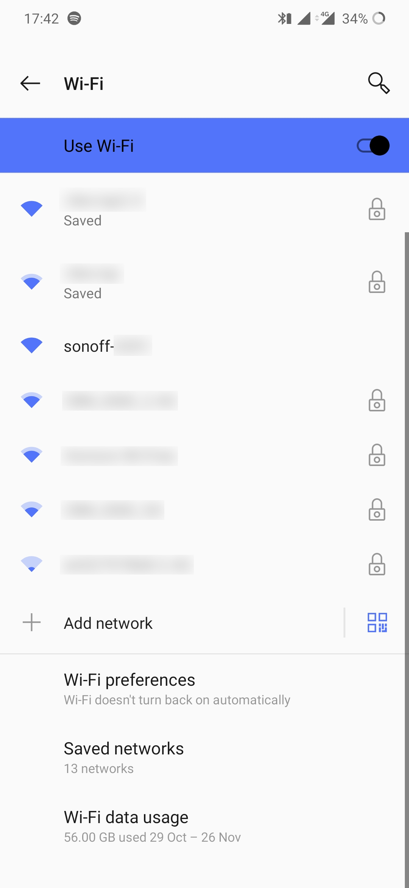
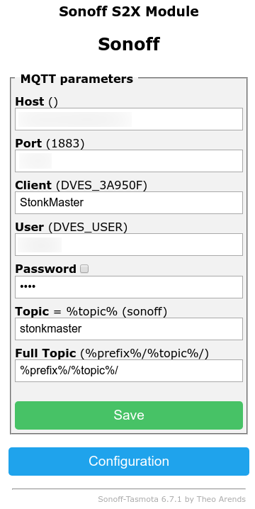

# StonkMaster
StonkMaster is an all-in-one solution that tells you when to _buy_ or _sell_ your favourite stonk.

Every 15 minutes (or your chosen interval supported by [Alpha Vantage](https://www.alphavantage.co/documentation/)),
the provided `stonks.py` script will update an MQTT topic telling a [Sonoff](https://sonoff.tech) to turn on/off based
on whether the stonk has gone up or down in value!

<p align="center">
  
</p>

_SELL, SELL, SELL!_

# Setup
You'll need a few things to get started:
 - Sonoff S20 - these can be had for cheap on AliExpress or Amazon
 - Soldering iron and USB to UART adapter - can also be had for cheap on AliExpress / Amazon
 - [Tasmota firmware][tasmota]
 - A computer with the [esptool](https://github.com/espressif/esptool) flashing utility
 - Server with Docker and Docker Compose

## Flashing the firmware
Sonoff devices typically ship with crappy Chinese firmware. [Tasmota][tasmota] is an open-source firmware supporting
many ESP8266-based devices with lots of features.

<p align="center">
    
    
    
</p>

1. Head to [releases page](https://github.com/arendst/Tasmota/releases) and download the latest version (the
`sonoff.bin` variant)
2. Open up the Sonoff (should be as simple as removing the three Phillips-head screws on the back and gently prying)
**Make sure the device isn't plugged into mains power while open!**
3. Solder a 4-pin header to the 4 unpopulated pins on the PCB _Note: Unfortunately with some newer devices it seems like
the PCB is stuck down by the PCB screw posts themselves, making removing the PCB difficult without causing damage - in
this case try to solder the header at an angle from above_)
4. Attach the device to a computer with a serial adapter, leaving GND disconnected for now (see photos above for pinout,
_don't forget to crossover the TX and RX connections!_)
5. Hold down the button on the PCB and connect GND - this will start the Sonoff in flashing mode
6. Run the following command to erase the stock firmware, replacing `/dev/ttySOMETHING` with the path to your serial
port:
    ```bash
    esptool.py --port /dev/ttySOMETHING erase_flash
    ```
7. Disconnect GND and then reconnect it while holding the flash button
8. Run the following command to flash Tasmota, replacing `/path/to/sonoff.bin` with the location of `sonoff.bin` that
you downloaded:
    ```bash
    esptool.py --port /dev/ttySOMETHING write_flash -fm dout 0 /path/to/sonoff.bin
    ```
9. Disconnect the serial adapter and close up the Sonoff again


## Getting an MQTT broker
[MQTT](https://mqtt.org) is a "machine-to-machine (M2M)/"Internet of Things" connectivity protocol", and Tasmota allows
commands to be issued to the device via messages published in MQTT topics.

You can set up your own MQTT broker easily enough, but for simplicity's sake we'll use
[CloudMQTT](https://www.cloudmqtt.com). Sign up for a free plan ("Cute Cat") and create a new instance for StonkMaster.
Once you're done, you should see something like the following in the control panel:

<p align="center">
    
</p>

Take note of "Server", "User", "Password" and "Port" - you'll need these values later.

## Configuring the Sonoff
Now that Tasmota has been flashed, you can configure it.

<p align="center">
    
    
</p>

 1. Plug the Sonoff into the wall and head to the WiFi settings menu on your phone
 2. Connect to the network named `sonoff-1234` (where `1234` will be a random number)
 3. Your phone should prompt you to "sign in" to the network and bring up the configuration interface - if not, open
your phone's browser and go to `http://192.168.4.1`
 4. Enter the details of your home WiFi network for the Sonoff to connect to
 5. Hit "Save" and the device will reboot in order to connect to your network
 6. Head to your computer and find your Sonoff's assigned IP address / hostname - this will depend on your router, but
usually involves going to the admin interface and looking at a list of connected devices (alternatively you could use
`nmap`!)
7. Type the address of your Sonoff into your browser
8. Go to "Configuration -> Configure Module" and set "Module type" to "Sonoff S2X" (click "Save" and the Sonoff will
reboot)
9. Once the device has rebooted, go to "Configuration -> Configure MQTT"
    - Set "Host", "Port", "User" and "Password" to the values from CloudMQTT from earlier
    - Pick a topic (and note it for later)
    - Click "Save" and wait for the device to reboot

<p align="center">
    
    
</p>

## Setting up the Stonks server
With the Sonoff connected to the broker, you can set up the server which actually controls the power!

1. Clone this repo on a machine with Docker and Docker Compose
2. Edit `docker-compose.yaml` and fill in your details (including your CloudMQTT values and Sonoff MQTT topic) - don't
forget to remove the `build: .` line unless you want to build the image yourself (it's on Docker Hub)
3. Do `docker-compuse up` to start the server

At this point, the `stonks.py` script will periodically query your stonk and tell your socket to switch on or off based
on whether it went up or down!

[tasmota]: https://github.com/arendst/Tasmota
